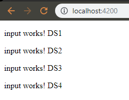
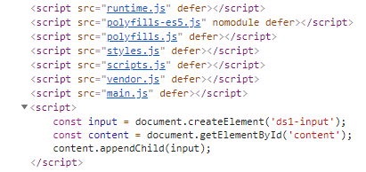
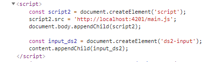
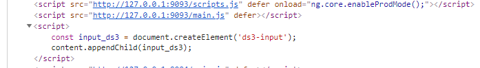
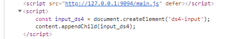
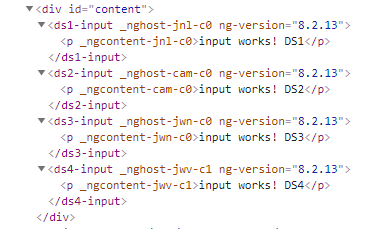

# MFEs

## Micro Frontends with Angular

`Enviroment`

- **npm install -g @angular/cli/**
- **npm -g live-server**

`Starts`

- cd ds4 && npm i && npm run build:externals
- cd ds3 && npm i && npm run build:externals
- cd ds2 && npm i && ng serve --port=4201 --single-bundle
- cd ds1 && npm i && ng serve

`Access`

### http://localhost:4200

### WebComponent Container isolated code NG, not single bundle

### WebComponent External, single bundle

### WebComponent, Exposed Modules NG

### WebComponent Read Exposed Modules NG

### Código gerado

## reference
### https://www.softwarearchitekt.at/aktuelles/